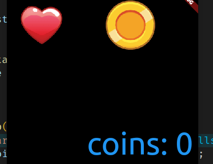

# Flame Bloc Demo



## Steps

1. Scaffold body is a `MultiBlocProvider` with child of `Stack`
2. `Stack` is `Game` and `ScoreScreen`
3. `ScoreScreen` is a `StatelessWidget` that returns a `BlocBuilder`. This is the same as
a normal Flutter bloc app
4. `Game` is a `StatelessWidget` returns a `FlameGame` instance with parameters for each bloc.
    `game: MainGame(coinBloc: context.read<CoinBloc>())`
5. `FlameGame` instance adds `FlameMultiBlocProvider`

```dart
  @override
  Future<void> onLoad() async {
    await add(
      FlameMultiBlocProvider(providers: [
        FlameBlocProvider<CoinBloc, CoinState>.value(value: coinBloc)
      ], children: [
        Coin(x: 200),
        Heart(x: 20),
      ]),
    );
  }
```

### 6. FlameBlocListenable mixin

`the SpriteComponent` uses `FlameBlocListenable<CoinBloc, CoinState>` listenable

```dart
class Coin extends SpriteComponent
    with
        Tappable,
        HasGameRef<MainGame>,
        FlameBlocListenable<CoinBloc, CoinState> {
  final double x;
  Coin({required this.x}) : super(position: Vector2(x, 30));
```

### 7. Change Coin State

```dart
  CoinState? state;

  @override
  void onNewState(CoinState state) {
    this.state = state;
  }
```

### 8. add event to bloc stream

```dart
 @override
  bool onTapUp(TapUpInfo info) {
    print('coin tapped');
    gameRef.coinBloc.add(IncrementCoinEvent());
    return super.onTapUp(info);
  }
```

## Environment

* flame_bloc 1.4
* flame 1.1.1
* flutter 3.0.1

## Reference

* https://github.com/flame-engine/flame/tree/main/packages/flame_bloc/example